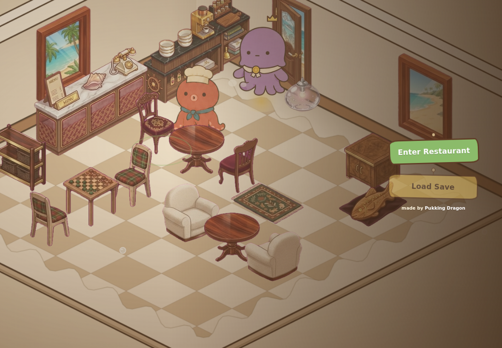
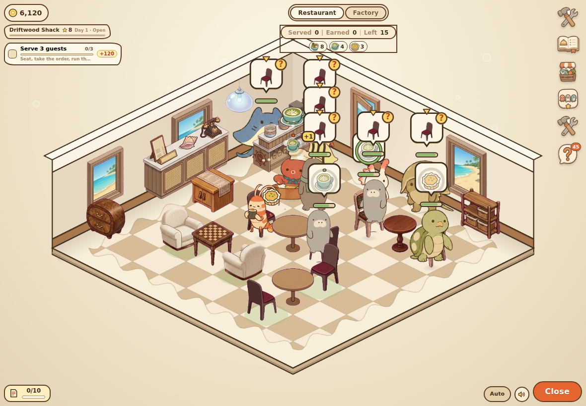
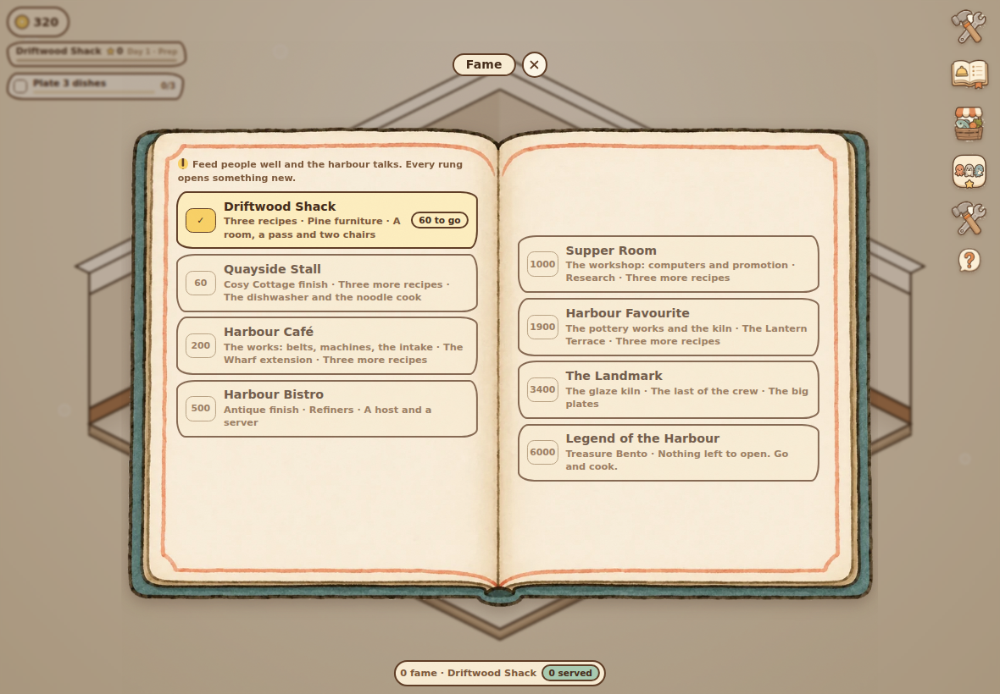
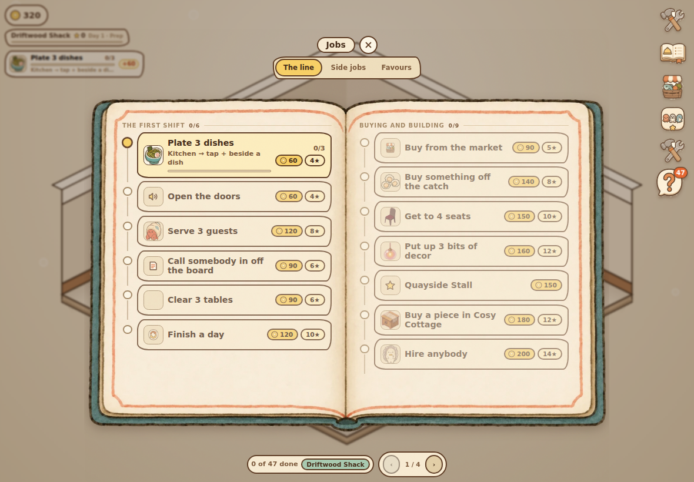
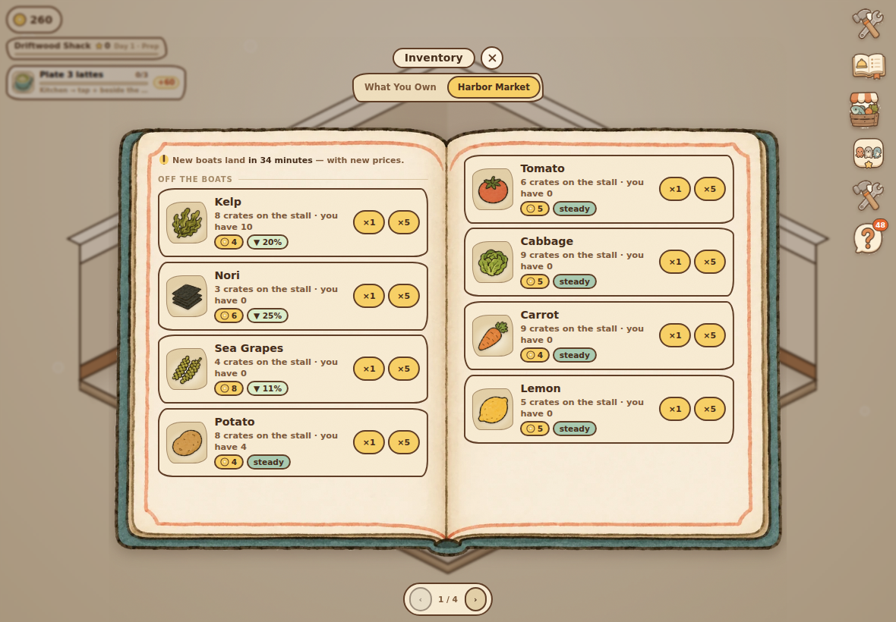
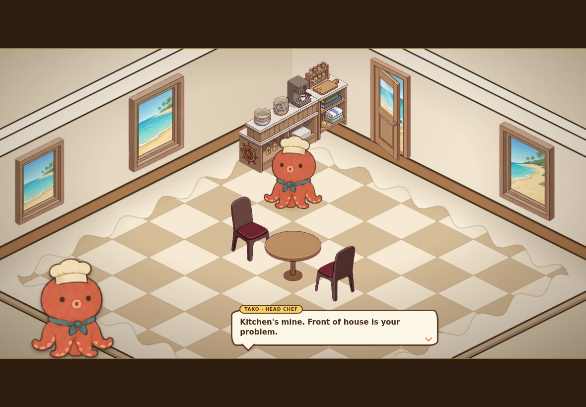
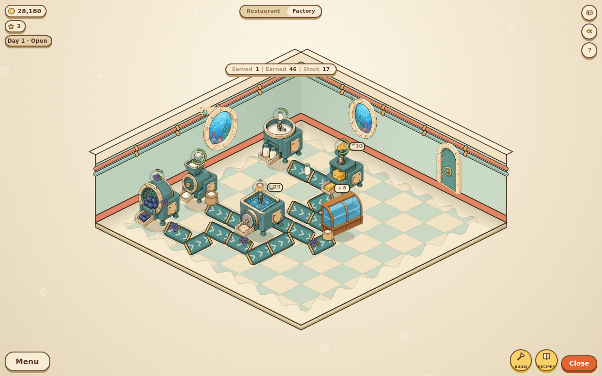

# Bubbleworks Harbor

A cosy 2D isometric restaurant-tycoon / factory-builder, built around the
Bubbleworks Harbor sprite pack. Grow and refine ingredients on conveyor lines,
plate up a menu, then open the doors and wait tables by hand — seating guests,
ringing in orders, and running plates out to tables while the tip clock ticks.

Everything is bought with one currency: **sand dollars**.









## Running it

The game is plain ES modules with no build step and no dependencies, but it does
`fetch` its atlas, so it needs to be served over HTTP rather than opened from
`file://`:

```sh
python3 -m http.server 8080
# then open http://localhost:8080
```

Any static server works (`npx http-server`, `caddy file-server`, …). Progress
saves to `localStorage` and the works keep producing while the tab is closed,
up to four hours of catch-up.

## The front door

The game opens on a **main menu** running on a **set**: not a picture of a
restaurant, and not your restaurant either, but a dressed room nobody has to have
built yet — antique tables, a lamp, a full house. The chef is at the pass, guests
arrive, are seated, order, and eat, because nothing about it is faked: it is the
game, played by something very good at it. The camera holds three composed shots
and cuts between them on a slow count.

There is no logo, no tagline and no figures on it. The room is what the game
looks like and it does not need a caption. Two hand-drawn signs hang over it on
their strings, crooked, where a thumb is: **Enter Restaurant** and **Load Save**.
They drop in once and then stay still — a sign that sways forever looks lovely
and is hard to hit.

The whole save is copied before the set goes up and handed straight back when you
press the button, and autosave is off for the duration — the demo cannot cost you
a coin or move a chair. The logo is a toy: press it and it squashes and blows
bubbles.

The **loading screen** is drawn rather than branded: **Tako**, the head chef,
bobbing beside a pot on a flame with bubbles coming off it. The pot and the spatula are drawn art out of the
pack, and his sprite is one small PNG loaded straight from the folder rather than
through the atlas, so all three are on screen long before anything else is —
which is the whole point of a loading screen.

It is a seaside: sky at the top, harbour water under it, a band of sand where
they meet and bubbles coming up from below.

**And you can play with it.** Tap the pot and he *stirs* — the hand goes round a
small circle and the blade tips with it, which is what a hand does; a rotate on
its own reads as a wave. The pot rocks the other way, an ingredient drops in and
the count goes up. It has no bearing on anything, which is exactly why it can be
there: a loading bar you are allowed to play with stops being a loading bar.

Settings — sound, motion, tips, the guide, credits and starting over — is on the
rail, in the game where the rest of the panels are. Motion off
stops the idling, drifting and breathing parts of the interface but never the
answer to a press: feedback is not decoration.

Then the chef gets the first word, and the **guide** follows: nine steps, each
pointing at the thing you have to press and waiting for you to actually press it,
**and each one pays**. The spotlight is a hole in a dark sheet, and the sheet
takes no pointer events at any point — the guide's job is to draw the eye, never
to trap the finger, so every step is done exactly the way it will be done later.
It follows things that move: the step that says *seat a guest* puts its light on
whoever is waiting. Finishing it is worth more than skipping it.

The guide is **him**, too — he leans out of the left edge of the bubble, the
bubble's tail points at whatever is lit, and the steps are pips rather than
"3 / 9", so you can see the whole guide at a glance.

## Fame

The game had money and it had a menu but no spine: everything was buyable on day
one if you saved up, so nothing ever *opened*. **Fame** is that spine. It is the
same number reputation always was — earned by feeding people well, lost by
keeping them waiting — but it has rungs on it now, and every rung puts something
new on the shelf.

| | |
|---|---|
| **Driftwood Shack** | Three recipes, pine furniture, a room and two chairs |
| **Quayside Stall** — 60 | Cosy Cottage finish, three more recipes, the dishwasher and the noodle cook |
| **Harbour Café** — 200 | The works: belts, machines, the intake. The Wharf extension |
| **Harbour Bistro** — 500 | Antique finish, refiners, a host and a server |
| **Supper Room** — 1,000 | The workshop, research, three more recipes |
| **Harbour Favourite** — 1,900 | The pottery works and the kiln, the Lantern Terrace |
| **The Landmark** — 3,400 | The glaze kiln, the last of the crew, the big plates |
| **Legend of the Harbour** — 6,000 | Treasure Bento. Nothing left to open |

One rule, everywhere: **fame gates what exists, coins gate when you get it.** A
rung never hands you a thing, it puts the thing on the shelf. Every catalogue in
the game — furniture, finishes, recipes, machines, crew, the extensions — runs
through the same gate, so a locked card shows the rank that opens it instead of a
price you cannot use. It reads as a shop window: you can see the whole thing, you
just cannot buy all of it yet.

The rank strip in the top-left is rank, fame, day and how far along the rung you
are, in one plaque — it replaced three separate readouts. Tapping it opens the
ladder. Crossing a rung is a card across the screen, a shower of sparks and the
chef's opinion; it never stops play, because it can land while you are holding
three plates.

## Starting from one dish

You open with **Kelp Latte** and nothing else. A menu of one is a puzzle rather
than a restaurant, which is the point: the first thing worth having is a second
dish, and the market sells every ingredient in the game, so getting there is a
choice about money rather than a wait for a machine. Kelp Ramen is ninety sand
dollars and Scallop Tart a hundred and seventy — both reachable inside the first
day if the first day goes well.

Everything above that is fame's job. See the ladder above.

## The cast

The head chef is called **Tako** and he says so — the cutscene bubble carries his
name and his job. Every species has a name too, drawn from a list by a hash of
their id, so the Sea Bunny is **Moss** every single time she comes in and the
diary can say *Moss the Sea Bunny*. A regular who is called something different
on Tuesday is not a regular. They thank you by name when they pay.

## The chef

There is one voice in the game and it belongs to the octopus at the pass. He has
been here longer than you and he is not especially impressed yet.

He talks, rather than captioning. Lines are **typed out** a character at a time
with a blip as they come, he bobs while he is speaking and settles when he stops,
and a tap mid-line finishes the line rather than skipping it — the affordance
every game with dialogue in it has and the one players reach for unprompted. The
bubble has a tail, so it reads as speech.

**Cutscenes** fire on their own at the moments worth marking — the first morning,
the first machine, the first kiln, three stars. The bars come in with a gold rule
on the inner edge and overshoot their mark, the room darkens at the corners, and
the camera **pushes in** on the thing being talked about rather than cutting to
it — a push-in is one of the few moves that reads as *look at this*, and only if
it takes a moment. Then the shot breathes: eleven pixels of drift on a slow sine,
which nobody will ever notice and which is the whole difference between a camera
looking at a room and a photograph of one.

He does not fade up in position, he **arrives**: out of frame, a leap, an
overshoot, and a squash on the landing that rebounds twice and settles. On every
line after the first he does a smaller version of the same, so a run of dialogue
has something happening in it, and while the words are coming he shifts his
weight — the strip has three poses and flicking between the first two on a beat
is most of what people actually do while they talk. The bubble lands a degree
and a half crooked and straightens up, with his name on a tab popping in behind
it and a chevron nudging for the next line.

They never interrupt an open panel, never talk over the guide, and each plays
once.

**And they never run mid-service.** They used to, and it was the worst thing in
the game: the bars came down, the HUD went to nothing, and the coins, the tally
and the Close button all vanished while three guests sat there waiting. Anything
he has to say once the doors are open he now says as an **aside** — the same
voice and the same typing, from the pass, bottom-left, over live play. No bars,
no camera, the HUD stays exactly where it is, lines move themselves along, and a
tap hurries them. A cutscene that grabs the screen while you are holding three
plates is a punishment rather than a story.

## Jobs

**Forty-nine of them**, and the board is a **tree**.

The first shift is one line, because a first shift is one line: plate a menu,
open the doors, serve three, cheer somebody up, clear the tables, get to day
two. There is one thing to do next and you have never done any of it.

After that it **forks**, five times, into eleven strands. Front of house is
chairs and colour and a room somebody would choose to sit in. The menu is more
to cook and better at cooking it. The larder is buying well and never running
dry mid-service. Then the works, regulars, and the craft.

Three things make a fork worth having, and this one has all three.

**The paths are about different things.** They are not one climb with three
labels on it.

**They pay in different currencies.** Front of house pays in fame, the menu
hands you a recipe outright, the larder sends crates you did not buy, the works
pay research, the craft pays clay and practice at the wheel. A branch you would
take for the money is not a choice — it is a right answer with two wrong
answers standing next to it.

**And nothing is lost by choosing.** A fork's strands stay on the board after
the line has moved past them, so taking the menu first means seeing the larder
second, not never. Permanent lockout in a game you play for an hour a night is
a way of asking people to replay from scratch, and nobody does — they just
stop.

At a fork the board prints a row of cards you can read in one look: the name,
the pitch, what it pays in, how far through it you are. That is the only part
that has to sit side by side, because a choice you have to scroll between is
not a choice you can compare. The strands themselves run full width underneath.
Tapping any job you can start **pins it** to the corner of the screen.

Every job leads with **what it is**, in a sentence somebody would say — "Four
at once instead of two. Twice the night, same rent." Underneath, and only on
the ones you can actually start, is where to go and do it. Those were one field
for a long time and the ticket showed the second, so the corner of the screen
said "Build → the Decor page" and never once said why.

Every one carries **its own picture**, borrowed from the game rather than drawn
for the list: the job about chairs shows a chair, the one about the whale shark
shows the whale shark, the one about the kiln shows the kiln. A quest log full of
identical ticks tells you nothing at a glance.

When a job fills, a sealed packet drops into the middle of the screen, sits for
a beat, and springs open — coins and fame both, since fame is the ladder and a
job that only paid money would be a detour from it. If it carried a prize, the
prize lists underneath, one line dropping in after the last, because being paid
twice is only twice as good if you notice it happening twice. The till rings,
coins and stars come off the ticket, and the chef says his piece a beat later.

The rail's last button opens the whole tree, walked rather than listed, ticked
off as you go. It is also the manual: a job board that names every system beats
a page of instructions nobody reads, which is why the How to Play panel is gone.

**Favours** are the third tab, and the only jobs you do not go looking for. One
guest in twenty walks in wanting *one particular dish* — a heart appears over
their head, their name and their order go on this page, and cooking it pays over
the odds and in hearts, because the point of somebody asking you for something is
that doing it makes them yours. It leaves when they do, which is the tension.

**Side jobs** are the other tab and the other track. The line is a story and it
only goes one way; these are the standing jobs a kitchen actually has — feed
this many more, clear ten tables, land five favourites, take another two thousand.
Three are up at a time and finishing one draws another, and each is measured from
the moment it was handed out, which is what lets the same job come round again
and still mean *ten more*.

## Playing

| | |
|---|---|
| **Factory** | Place a machine, drag a conveyor away from it, and end the line at a Pantry Intake. Refiners sit mid-line and turn cheap goods into valuable ones. |
| **The morning** | Every day opens with the catch: three things cheap on the quay, and one dish the harbour has a taste for that pays a third over the odds. |
| **The Kitchen** | One book for everything about food — today's menu, what you can learn, what you can improve, and the larder. Set how many of each dish to plate up; ingredients leave the larder immediately, so only plate what you can sell. |
| **A word** | Tap anybody who is waiting and the chef has a word with them: it puts a slice of patience back and can be done again after a moment. There is no button for it and the guide never mentions it — somebody standing there getting crosser is the only prompt it needs. |
| **Open up** | Guests wander in and wait by the door. Tap one to seat them at a free chair, or tap an empty seat to pull in whoever has been waiting longest. |
| **Auto** | Beside the Open button. With it on, a dish that sells out goes straight back on for as long as the larder can pay for it — so a day ends when you run out of ingredients rather than when you run out of patience for the stepper. Nothing caps the queue either way: what is left on the menu sits on screen, dish by dish, while you serve. |
| **Orders** | Tap the bubble over a seated guest — the one with the `!` sticker — to send the ticket to the chef. |
| **Service** | Drag the finished dish off the kitchen pass onto the guest who ordered it. Tap-then-tap works too. |
| **Payment** | Guests pay on how briskly they were served. Let a patience meter empty and they walk out, costing reputation. |
| **Washing up** | A guest who has eaten leaves a plate behind, and that chair is out of service for five seconds while it is scrubbed. The Deep Sink halves it and a Dishwasher all but removes it. |
| **Inventory** | Everything you own in one place: the larder, what is plated, your flyers, clay, research and forged crockery. |
| **The market** | The other tab of the inventory, and it sells **everything** — the catch off the boats, the grown goods, the refined ones. A kitchen that cannot buy a pint of milk on day one is a kitchen that cannot open. What keeps the works worth building is the markup: anything a machine could have made costs about three times what it is worth over the counter. The boats land once an hour: a fresh stall, a fresh set of prices. Every crate is counted, so a stall can sell out, and every price drifts up or down by as much as a third against its usual — the card says which way and by how much, and a countdown says how long until the next delivery. Today's catch takes another 40% off three of them. |

Fancier furniture finishes (Seaside Pine → Cosy Cottage → Antique) and decor raise the
room's **ambience**, which pulls guests in faster, stretches their patience and
grows their tips. Hiring crew — the Crew tab of the build menu, since a hire is
something you put in the room — automates the fiddly parts: the Oyster Host seats
guests, the Cuttlefish Server runs plates, cooks add parallel burners, the
Mechanic speeds up the works.

## The long game

| | |
|---|---|
| **Guest Diary** | Every species has a flavour they love and one they cannot stand. Serving the right one is triple hearts and a better tip, and it is the only way to learn what that flavour was. Fill the hearts and they start bringing presents. |
| **Rarity** | Six **VIPs** — a crowned whale shark, a top-hatted seahorse, a pearl manta — pay double. Four **Mythicals** out of deep time pay four times over. Each has its own animation, so a rare guest is a different animal and not a recoloured regular. |
| **Research** | A Harbour Computer on the factory floor banks points while you work. Tap the machine itself to spend them, on flyers, machine speed, the washing-up and trade. |
| **Pottery** | Build a **Harbour Kiln** in the works and tap it to take a turn at the class. Serving levels it; from level five you can forge: spend clay and money, stop the needle in the band, and one recipe gains a star and a permanent price rise — served from then on on real crockery, plainer or finer with the tier. A Clay Press digs the clay, a Potter's Wheel takes a round off the forge, a Glaze Kiln adds 15% to anything forged. |
| **Expanding** | Knocking through to the wharf and then the terrace grows the dining room from 9×9 to 13×13 — the only way to fit more tables. It is the Expand tab in the build menu, beside the furniture it makes room for. |

The ladder is deliberate: everything you buy exists to take a job off your
hands — the seating, the serving, the plating and the pantry runs.

Pinch or scroll to zoom, drag to pan, `Tab` to switch rooms, `R` to turn what
you're placing through its four sides, `Esc` to cancel.

## Layout

```
index.html            markup for the canvas plus the DOM HUD
styles.css            the sticker UI: chunky brown outlines, cream panels
assets/               generated sprites + atlas.json  (see tools/)
tools/                slicers that regenerate assets/ from the source art packs
src/
  main.js             boot, asset loading, fixed-step loop
  game.js             zones, camera, input routing, day cycle
  state.js            save file and every derived stat read off it
  core/               loader, tweens/springs, pointer, blip synth, helpers
  gfx/                canvas drawing kit and the particle system
  world/              iso math, procedural rooms, guests, kitchen, factory
  ui/                 HUD, the book panels, the menu, the guide and the chef
  data/               ingredients, recipes, buildables, staff, guests, progress
```

The world is a single `<canvas>`; the HUD and panels are real DOM so CSS can do
the styling and native scrolling.

**Nothing in the interface is a moulded object.** The game is hand-drawn, so the
interface has no business pretending to be plastic: no bevels, no lit top edges,
no sheen down the front, no hard shadow underneath, nothing rotated in three
dimensions. What separates one thing from another is the line and the fill — an
ink outline round anything you can press, a flat paper fill inside it, and four
mismatched corner radii so the rectangle looks like a hand went round it. A press
is a press of a pen: the mark gets smaller and darker for a moment. The page
turn is a leaf sweeping flat across the paper with a crease down its leading
edge, not a card spinning on a Y axis.

The navigation is a column of the pack's own painted icons down the right-hand
edge — no button, no frame, no caption. Every icon in that sheet is already drawn
as a little card with cream paper, an ink outline and a shadow of its own, so
wrapping each one in another cream circle drew the same frame twice and looked
it. The button is now nothing but a tap target with a picture in it.

Nothing in that column sits still: each icon floats on its own slow loop, offset
from its neighbours so the rail ripples rather than pumps; a press squashes and
overshoots; the live one arrives with a bounce and rides bigger and closer to the
thumb; and they all drop in one after another when the game opens. It is above
the scrim and the sheet on purpose — with it buried, moving between panels meant
close-then-open, so tapping Diary while the Kitchen is up simply switches, and
tapping the panel already showing closes it. Open! breathes until you press it:
motion is what tells you a corner of the screen is for pressing.

`skinIcons` installs those images as one injected stylesheet rather than as
inline styles on whatever existed at boot, so every card the panels build later
gets the painted icon too.

**Every panel is a book.** Not a cream rectangle with a picture behind it — the
drawing is the panel, and the writing goes on the page. Three of them are ruled
spreads whose boxes the content is cut to fit: the Kitchen (three to a page), the
Diary (an index of four and a page-sized panel), and the morning catch. The rest
are written into the blank notebook. The slot geometry is measured off the art
rather than guessed, so a dish lands inside its box at any size, and the margin
the books were drawn on is flooded to transparency so the covers float instead of
sitting on a rectangle of paper.

Nothing is ever stretched and nothing is ever cropped. The wrapper is a CSS size
container, so the drawing takes the largest width that still leaves room for its
own height — "contain", done in the layout rather than by cutting the picture.
Where there is room it shows both leaves; where there is not it shows one, at
twice the scale, slid to the page you are reading — half the width at twice the
size is the same picture, exactly, so a phone gets a single undistorted page
rather than a squashed spread.

A book that scrolls is not a book, so the blank notebook **paginates**. Each card
is laid on the page at the width it will be read at and its height is read back —
margins included, since a section heading carries one — and when the next card
would run off the bottom it starts the next page. Two leaves on a wide screen and
one on a phone, so the same list simply falls into more pages on a phone, which is
what a smaller book does. Three printer's rules come with that: a heading left at
the foot of a column goes over with the list it announces rather than standing
there as a widow; a list short enough to fit is broken halfway down by height, so
you never get a full left page and a blank right one; and a page with two lines on
it centres them on the leaf instead of jamming them under the top rule.

Turning a page turns a page. The leaf is cut to the size of the page on screen
and pinned to the panel — not inside the body it is about to replace — so it
rotates about the gutter in 3D with a light running off it while the new page is
written underneath. Both its faces are the paper itself, offset to the leaf each
one stands in for.

A menu line is set the way a printed one is — name, leader dots, price. The day's
catch arrives on one of the pack's twenty illustrated menu cards.

Two things a placement preview must say — what am I holding, and which way is it
facing — so the ghost is a **blueprint** (drafting blue, hard white cut line, the
drawing faint underneath) and the strip along the bottom names the piece and
shows its facing as four dots. Nothing in the game glows any more: a coloured
bloom around hand-drawn art only ever read as a rendering fault, so a selected
piece is marked on its tile and a plate you have picked up rides a dashed ring.

**And the rooms stopped shouting.** Three systems were competing to say *look
here* and two of them were made of floor decals: every free chair sat in a pool
of green light the whole time anybody was queuing, and every machine without a
belt on its spout flashed a dashed diamond in front of it — ten machines to ten
diamonds, over a floor that already has belts moving on it. Every chair you had
not yet given a table wore a question mark bobbing above it. None of it said
anything the game was not about to say better: a backed-up machine announces
itself, the build panel explains a chair with no table in words, and a chair is
fairly obviously a chair.

So each room hands back **at most one thing** that genuinely wants a player right
now — a guest whose meter is past halfway with a chair going spare, a table
nobody has wiped, the one machine with nowhere to send its output — and that
borrows the **pointer**, which is the one thing in the game whose whole job is
saying *here*. A cross guest outranks the standing job while they are cross: the
job will still be there in ten seconds and the guest will not.

Readouts do not take pointer events. The service tally floats over the middle of
the room, which is exactly where the kitchen pass sits, and a `<b>` inside it was
quietly eating taps meant for a finished plate.

The rota and the catalogue are the two panels worth designing properly, because
they are the two you spend money in. A hire is a drawn character, so they get a
standing portrait frame rather than the little square well a crate of carrots
gets, and the roster is read the way a rota is — front of house, the kitchen, the
works, the office, each with how many of its posts you have filled. Somebody on
the books turns their card green and stamps it. The catalogue is a shop window:
the drawing is the biggest thing on the card and it is shown in the finish you
have picked, since the same chair in pine and in walnut are two different things
to buy, with what it does to the room set out as plain figures and how many you
already own on the corner of the art.

Panels earn their place on the rail by being opened often, and the ones that did
not are gone. There is no Harbour Menu any more — a hub whose job was to hold
four buttons is four buttons and one extra tap. Expanding the room and hiring
crew are tabs in the build menu, because both are things you put in the room.
Research is on the Harbour Computer: the machine banks the points, so the machine
spends them. The kiln is the same — you build it in the works and tap it, since
throwing a pot is a job that happens somewhere. What is left on the rail is
Build, Kitchen, Inventory, Diary and Settings, and Settings is where the guide,
the credits and the way back to the main menu live.

On a phone the panel fills the width, which puts the rail straight over its close
button, so the rail steps aside while a panel is open. On a wide screen the panel
is narrower than the room and the rail stays, so one tap still flicks between
panels.

### Notes on the art

Four source packs, all sliced into `assets/` with `assets/atlas.json` as the
index. `art_pack_03` came from the companion **reimagined-sniffle** repo, and
`art_pack_04` was uploaded alongside this one:

- `Bubbleworks_Harbor_Character_Pack_01/` — guests, staff, ingredients, food and
  factory machines. Flat JPEG contact sheets on a magenta key or the cream paper
  backdrop, plus 3-frame character strips (idle / walk / eat).
- `art_pack_02/` — the dining room: furniture in three finishes, wall joinery
  (doors, windows, counters) in two woods, and three more guests. Every piece of
  furniture ships two drawings: `_f` faces screen down-left, `_b` is the same
  piece turned to face up-right. Mirroring swaps the two ground axes — down-left
  becomes down-right, up-right becomes up-left — so those two plus a flip give
  all four isometric turns, every one a real drawing. Rotate cycles them, and a
  chair picks the one that faces its table.
- `…/additional_assets/07_dolphin_whale_manatee_walrus_character_sheet.jpeg` —
  four more regulars on a 3×4 magenta grid.
- `art_pack_03/vip/` — six VIP and four mythical guests, each a 1152×384 strip
  of idle / walk / eat already on transparency, so this stage only trims and
  rescales to the game's character height.
- `art_pack_03/plates_*_sheet.png` — forty serving dishes, roughly plain
  earthenware through to gilded china. A forged dish draws its plate from the
  band its tier earns, picked by a hash of the recipe id so every dish keeps its
  own crockery.
- `art_pack_03/machines_*_sheet` — thirty machines, including the computers the
  research and promotion buildings now use.
- `art_pack_03/ui_icons_sheet.png` — the interface icons. `skinIcons` swaps them
  over the built-in SVGs at boot, so the markup keeps its `.ico-*` classes as
  the fallback for anything the pack doesn't cover.
- `art_pack_04/pottery_works_sheet.png` — eight verdigris-and-brass machines, the
  kiln and the throwing wheel among them. Pottery is a trade with a floor now,
  so it needed buildings.
- `art_pack_04/menu_cards_sheet.png` — twenty illustrated cards. Hand-laid at
  differing sizes rather than gridded, so they are found by colour: the backdrop
  measures (247,242,236) against the cards' warmer (248,226,190), which is a
  clean 40 levels apart on the blue channel.
- `art_pack_04/book_menu.png`, `book_diary.png`, `book_plain.png` — three open
  spreads: the ruled menu, the diary, and the blank notebook every other panel is
  written into. They back a DOM panel rather than a canvas sprite, so they are
  trimmed, scaled and written as WebP for CSS to pick up — with the margin they
  were drawn on flooded to transparency, so a cover floats instead of sitting on
  a rectangle of paper.
- `art_pack_04/kitchen_tools.png` — a pot and a spatula on cream, for the
  loading screen. Cut apart by their own ink rather than by a grid: they are
  nowhere near the same size, and each crop is masked to its own blob so the
  spatula does not carry a slice of the pot's handle.
- `art_pack_04/blueprint_sheet.png` — a drafting sheet, kept opaque and
  rectangular because that is what a sheet of paper is. It is the placement
  ghost's paper.

Every sheet across the four packs is sliced except the three superseded
furniture sheets, the two painted room plates that the generated rooms replace,
and `art_pack_02/livestock_pixel_sheet.png` — the pens it drew are gone.

```sh
pip install pillow numpy scipy
python3 tools/slice_assets.py    # character pack
python3 tools/slice_pack02.py    # furniture, joinery, extra guests
python3 tools/slice_pack03.py    # the rare cast, plates, machines, UI icons
python3 tools/slice_pack04.py    # the pottery works, menu cards, the paper
```

They lift the backdrop, group ink blobs so hand-laid items never clip their
neighbours, trim every sprite, and merge into the atlas. The second also
despills: a lamp's clear glass shows the magenta backdrop straight through, so
those pixels are turned back into translucent glass rather than left as a pink
dome.

Rooms are **generated** — checkerboard floor, scalloped border, sheared walls
with cornice, baseboard and a picture rail two thirds up — because the original
painted room plates are hand-drawn and their floors don't sit on a consistent
lattice, so build tiles could never line up with them.

The whole room is **inked**. Every object in the game is drawn with a heavy dark
edge round it and the room was the one thing that was not: cream panels meeting
cream panels, with a thin line on a couple of the joins. Set a 4px-inked chair on
that and the chair reads as a sticker on a photograph. So the silhouette is one
5px stroke, every internal join is inked, and the floor's scalloped mat runs one
scallop per tile in the same weight — it used to be nine small ripples an edge in
pale tan, which at any real zoom read as a smudge.

**And the room separates by value.** Two goes at this. The note in the source
said a strongly coloured floor turns every sprite standing on it into a sticker,
which is true, and the fix went much too far: the walls, the floor and the ground
behind the building all ended up within about eight percent of one another. Cream
on cream on cream. No amount of ink makes a room out of that, because there is
nothing for the ink to separate — the whole picture was one value and the only
things in it with any colour were the chairs and the customers.

The second go reached for a cool harbour blue on the walls, which separated them
all right and did not belong to this game for a second. Every drawing in it — the
oak, the cream, the guests — is warm, and a cold wall behind warm art reads as two
different games stitched together.

So the separation is done the way an illustrator would do it: one family, and the
planes told apart by how light they are. A deep warm sand on the wall in shadow,
a lighter one on the wall in light, cream trim above both, wood below, a floor
lighter than either wall so people standing on it read against it, and a ground
behind the building taken well down so the outline has something to be an outline
against. Four clear steps of value, no second hue anywhere.

The doors and windows set into those walls are real sprites from the fixture
sheets, and they are drawn as flat elevations on their own isometric — about
thirty degrees, where the room is a true 2:1 at 26.57. Something has to give.

**Shearing is the obvious answer and it is the wrong one.** A shear that brings a
thirty-degree top edge down to 26.57 leans every *vertical* in the drawing by the
difference — three degrees on a door, nearly five on a window. So the head of each
door sat beautifully parallel to the picture rail while both jambs quietly fell
over, and every mullion in every window went with them. That was the bug people
saw as "the placement is off": it was never the placement, it was the projection.

**Widening fixes it exactly and bends nothing.** Scale a drawing horizontally by
k and its top edge's slope becomes slope/k, while every vertical stays vertical,
because a vertical has no run for the scale to act on. So k is the drawing's own
slope over the wall's, the heads land parallel and the jambs stand up. It costs a
window eleven per cent of its width, which nobody has ever noticed on a window.

Sizing them is not "how tall is the file" either. A third of every drawing is the
empty triangle either side of its own slope, so what matters is the body: a window
is 272 tall on disk and 185 of that is glass and frame, a door is 338 and 263 of
it is door, against a plaster field of 238. Sized against the file the windows
came out postage-stamp sized in a tall blank field, which is exactly how you draw
a picture frame. The same triangle is why doors used to hover: anchoring a door's
*box* to the floor line leaves its threshold half a slope up in the air, so
floor-anchored pieces drop by that amount and stand on the floorboards.

Slope is measured off each drawing's own top edge (Theil–Sen, which shrugs off a
door handle), and that is right for a plain window and nonsense for one topped by
something else — an earlier slicer recorded 0.137 for the open casement and -0.713
for the pass counter, having measured a swung leaf and a shelf of jars. A sheet is
drawn on one projection, so a measurement outside a plausible band is a
measurement of the wrong edge and the sheet's own median stands in.

The joinery changes wood along with whatever finish the dining room mostly uses. The whole room is rasterised once into an offscreen canvas and
blitted per frame.
